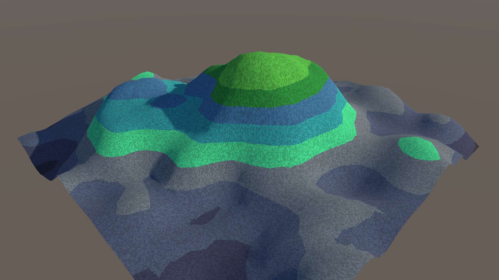
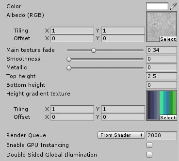

## TerrainGradient

Unity standard render pipeline surface shader, which demonstrates how to create a world space height gradient effect.

Height gradient is applied from a texture and there's also support for one diffuse color texture.

It's possible to adjust bottom and top values which control the gradient start and end.

I created this only as a reminder snippet for myself.

### Shader in action

### Shader UI

